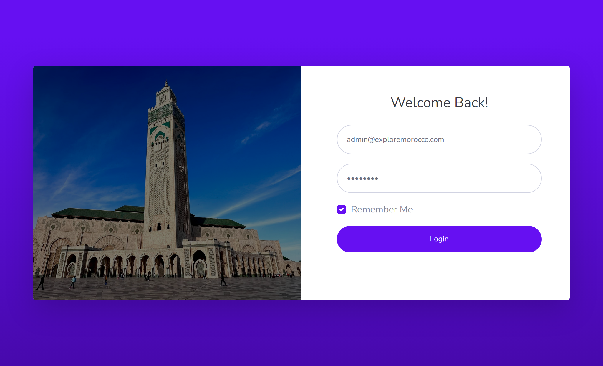
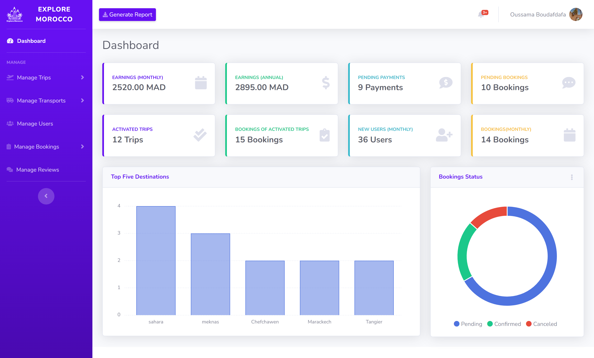
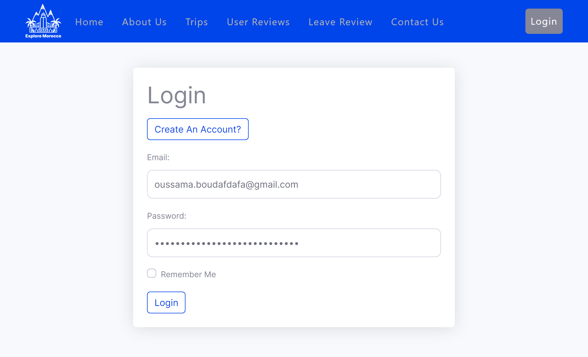
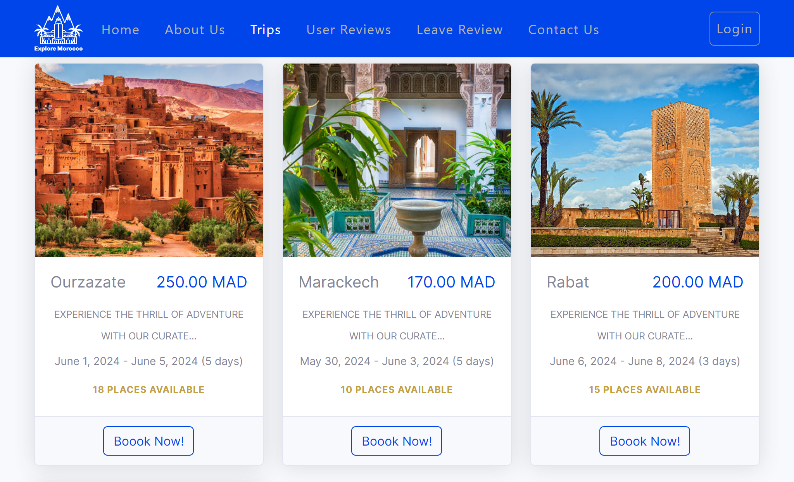
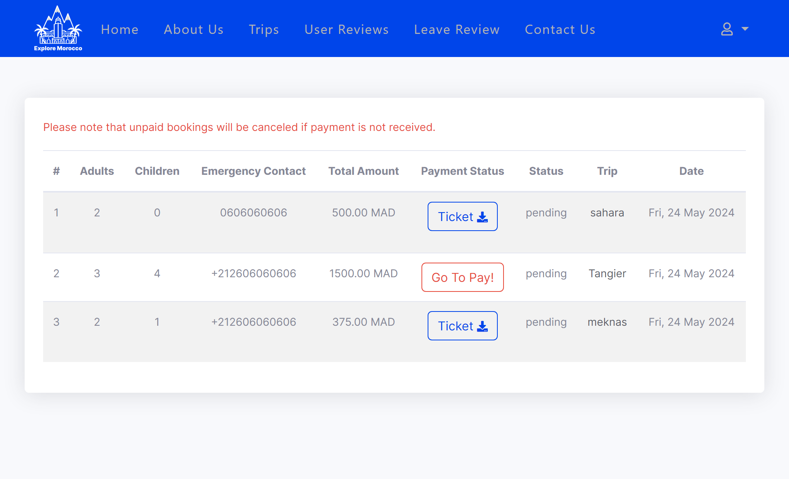

# 🛫 Travel Management Web Application

## 📝 Description

This project is a **web application for managing travel reservations**. The platform streamlines the **booking process, user management, and payment tracking**, providing a centralized and efficient solution for travel agencies.

## 🚀 Features

### 🔹 Admin Panel:
- **Authentication**: Secure login and logout.
- **Travel Management**: Create, edit, and delete trips (destinations, dates, transport, activities...).
- **User Management**: View user profiles, reviews, and reservations.
- **Booking & Payment Tracking**: Monitor bookings and update their statuses (pending, confirmed, canceled).
- **Statistics & Reports**: Dashboard with key metrics and downloadable reports.
- **Moderation**: Manage user reviews and contact messages.

### 🔹 User Features:
- **Authentication**: Sign up, log in, and log out.
- **Browse Available Trips**: View travel options with details and interactive maps.
- **Book a Trip**: Reserve a trip and download tickets after payment.
- **Reservation History**: Check past bookings and complete unpaid reservations.
- **Profile Management**: Update personal information and delete accounts.
- **Agency Interaction**: Contact the agency via a form and read user reviews.

## 🛠️ Tech Stack

- **Backend**: Laravel, MySQL
- **Frontend**: HTML, CSS, JavaScript, jQuery, Bootstrap
- **Tools & Services**: Composer, Mailjet, Stripe, Figma, SASS, Git, GitHub

## 🔒 System Requirements

- **User-Friendly Interface**: Intuitive and easy to navigate.
- **Reliability & Performance**: Optimized response times and multi-browser compatibility.
- **Security**: Robust protection against attacks and data breaches.
- **High Availability**: Efficient error handling and regular backups.
- **Maintainability**: Well-structured and clean code for future updates.

## 🖼️ Screenshots

### 🔹 Admin Panel:
  
  
  

### 🔹 User Features:

